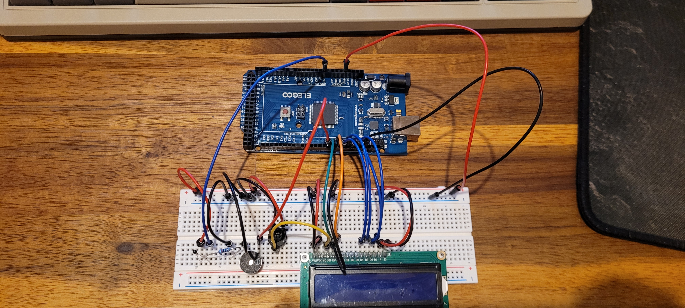

# LCD Thermostat with buzzer
Once the thermistor(10k) reaches a certain temperature, the buzzer will start emmiting a sound.
The current minimum temperature for the sound is 20 degrees celsius.

The LCD screan shows both Celsius and Farenheit
## Test
<video src="./assets/Test.mp4" width="320" height="240" controls></video>
## Wiring
